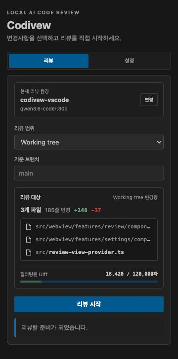

# Codivew for VS Code

Review Git changes with a local Ollama model without leaving VS Code.

Codivew supports English and Korean across the review view, notifications, generated feedback,
reports, commands, and settings. It follows the VS Code display language by default, or you can
select a fixed language from the **Settings** tab.



## Features

- Review working tree, staged, or branch changes.
- Select any model installed in your local Ollama instance.
- Preview changed files, lines, and filtered Diff size before starting.
- Select the changed files to include in each review with live Diff statistics.
- Limit large reviews to avoid context overflow and slow responses.
- Browse structured findings by file and severity, then jump directly to the source line.
- View findings directly in the VS Code Problems panel.
- Open a complete HTML report after each review.

## Requirements

- VS Code 1.95 or later
- A Git repository opened as a workspace
- [Ollama](https://ollama.com/) running locally or on an accessible server
- At least one model installed in Ollama

## Getting Started

1. Open **Codivew** from the Activity Bar.
2. Select a workspace and enter the Ollama server URL.
3. Choose an installed model and save the initial settings.
4. Select the review range and click **Start review**.
5. Review findings in the **Results** tab, jump to the source, or open the complete report.

Language, workspace, Ollama connection, model, and maximum Diff size can be changed from the
**Settings** tab.

## Review Ranges

- **Working tree**: unstaged and untracked changes in the current workspace
- **Staged changes**: changes currently added to the Git index
- **Branch changes**: changes compared with a selected base branch

## Development

```bash
npm install
npm run check
npm run package
```

Use `npm run test:extension` to run the VS Code integration test.

Codivew imports its review engine from the public `codivew/core` API.
